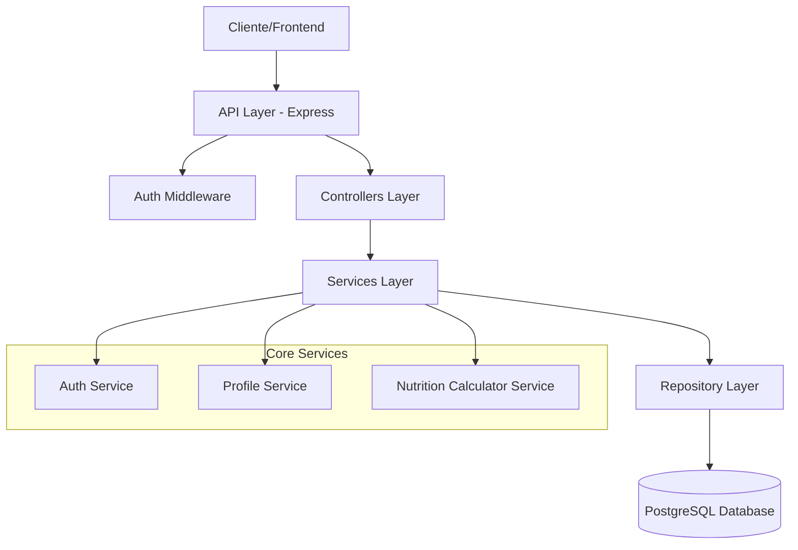

# Design Document

## Overview

Nutriabb MVP es una aplicación backend construida con Node.js y Express que proporciona servicios de autenticación y cálculos nutricionales personalizados. La arquitectura sigue un patrón de capas con separación clara entre controladores, servicios, repositorios y modelos de datos. Utiliza PostgreSQL como base de datos principal y JWT para autenticación.

## Architecture

### System Architecture



### Technology Stack

- **Runtime:** Node.js
- **Framework:** Express.js
- **Database:** PostgreSQL
- **Authentication:** JWT (jsonwebtoken)
- **Password Hashing:** bcrypt
- **Database Client:** pg (node-postgres)
- **Validation:** joi
- **Testing:** Jest
- **Environment Management:** dotenv

## Components and Interfaces

### API Layer

#### Authentication Endpoints
- `POST /auth/register` - Registro de nuevos usuarios
- `POST /auth/login` - Autenticación de usuarios existentes

#### Profile Management
- `POST /profile` - Crear/actualizar perfil de usuario (requiere autenticación)

#### Nutrition Calculator
- `GET /calculate` - Obtener cálculos nutricionales personalizados (requiere autenticación)

### Service Layer

#### AuthService
```typescript
interface AuthService {
  register(email: string, password: string): Promise<User>
  login(email: string, password: string): Promise<{ user: User, token: string }>
  generateToken(userId: number): string
  verifyToken(token: string): Promise<User>
}
```

#### ProfileService
```typescript
interface ProfileService {
  createOrUpdateProfile(userId: number, profileData: ProfileData): Promise<Profile>
  getProfile(userId: number): Promise<Profile | null>
}
```

#### NutritionCalculatorService
```typescript
interface NutritionCalculatorService {
  calculateNutrition(profile: Profile): NutritionResult
  calculateBMR(age: number, gender: string, height: number, weight: number): number
  adjustForActivity(bmr: number, activityLevel: string): number
  calculateMacros(calories: number): MacroDistribution
}
```

### Repository Layer

#### UserRepository
```typescript
interface UserRepository {
  create(email: string, passwordHash: string): Promise<User>
  findByEmail(email: string): Promise<User | null>
  findById(id: number): Promise<User | null>
}
```

#### ProfileRepository
```typescript
interface ProfileRepository {
  create(userId: number, profileData: ProfileData): Promise<Profile>
  update(userId: number, profileData: ProfileData): Promise<Profile>
  findByUserId(userId: number): Promise<Profile | null>
}
```

## Data Models

### Database Schema

#### Users Table
```sql
CREATE TABLE users (
  user_id SERIAL PRIMARY KEY,
  email VARCHAR(255) UNIQUE NOT NULL,
  password_hash VARCHAR(255) NOT NULL,
  registration_date TIMESTAMP DEFAULT CURRENT_TIMESTAMP
);
```

#### Profiles Table
```sql
CREATE TABLE profiles (
  profile_id SERIAL PRIMARY KEY,
  user_id INTEGER REFERENCES users(user_id) ON DELETE CASCADE,
  age INTEGER NOT NULL,
  gender VARCHAR(10) NOT NULL CHECK (gender IN ('male', 'female')),
  height DECIMAL(5,2) NOT NULL, -- cm
  weight DECIMAL(5,2) NOT NULL, -- kg
  activity_level VARCHAR(20) NOT NULL CHECK (activity_level IN ('sedentary', 'light', 'moderate', 'active', 'very_active')),
  created_at TIMESTAMP DEFAULT CURRENT_TIMESTAMP,
  updated_at TIMESTAMP DEFAULT CURRENT_TIMESTAMP
);
```

#### Future Tables (Structure Only)
```sql
CREATE TABLE glucose_logs (
  log_id SERIAL PRIMARY KEY,
  user_id INTEGER REFERENCES users(user_id) ON DELETE CASCADE,
  glucose_level DECIMAL(5,2),
  measured_at TIMESTAMP DEFAULT CURRENT_TIMESTAMP
);

CREATE TABLE ingredients (
  ingredient_id SERIAL PRIMARY KEY,
  name VARCHAR(255) NOT NULL,
  calories_per_100g DECIMAL(6,2),
  created_at TIMESTAMP DEFAULT CURRENT_TIMESTAMP
);

CREATE TABLE recipes (
  recipe_id SERIAL PRIMARY KEY,
  name VARCHAR(255) NOT NULL,
  description TEXT,
  created_at TIMESTAMP DEFAULT CURRENT_TIMESTAMP
);
```

### Application Models

#### User Model
```typescript
interface User {
  user_id: number;
  email: string;
  password_hash: string;
  registration_date: Date;
}
```

#### Profile Model
```typescript
interface Profile {
  profile_id: number;
  user_id: number;
  age: number;
  gender: 'male' | 'female';
  height: number; // cm
  weight: number; // kg
  activity_level: 'sedentary' | 'light' | 'moderate' | 'active' | 'very_active';
  created_at: Date;
  updated_at: Date;
}
```

#### Nutrition Result Model
```typescript
interface NutritionResult {
  calories: number;
  macros: {
    carbohydrates: number; // grams
    proteins: number; // grams
    fats: number; // grams
    fiber: number; // grams (25-30g recommendation)
  };
  percentages: {
    carbohydrates: number; // 45-60%
    proteins: number; // 10-20%
    fats: number; // 20-35%
  };
}
```

## Error Handling

### Error Response Format
```typescript
interface ErrorResponse {
  error: {
    message: string;
    code: string;
    details?: any;
  };
  timestamp: string;
}
```

### Error Categories

1. **Validation Errors (400)**
   - Invalid input data
   - Missing required fields
   - Format validation failures

2. **Authentication Errors (401)**
   - Invalid credentials
   - Expired or invalid tokens
   - Missing authentication

3. **Authorization Errors (403)**
   - Insufficient permissions
   - Access to restricted resources

4. **Not Found Errors (404)**
   - User not found
   - Profile not found
   - Resource not found

5. **Conflict Errors (409)**
   - Email already exists
   - Duplicate resource creation

6. **Server Errors (500)**
   - Database connection issues
   - Unexpected server errors

### Global Error Handler
Implementar middleware de manejo de errores que capture todas las excepciones y devuelva respuestas consistentes.

## Testing Strategy

### Unit Testing
- **Services Layer:** Probar lógica de negocio aislada
  - Cálculos nutricionales (fórmula Mifflin-St Jeor)
  - Validaciones de datos
  - Transformaciones de datos

- **Repository Layer:** Probar operaciones de base de datos con mocks
  - CRUD operations
  - Query building
  - Error handling

### Integration Testing
- **API Endpoints:** Probar flujos completos end-to-end
  - Registro y login de usuarios
  - Creación y actualización de perfiles
  - Cálculos nutricionales completos

- **Database Integration:** Probar con base de datos de prueba
  - Migraciones de esquema
  - Constraints y relaciones
  - Transacciones

### Test Data Management
- Usar factory functions para crear datos de prueba
- Implementar setup/teardown para limpiar datos entre pruebas
- Usar base de datos separada para testing

### Nutrition Calculator Testing
Casos de prueba específicos para la calculadora nutricional:

1. **BMR Calculation Tests:**
   - Hombre: 25 años, 180cm, 75kg → BMR esperado ≈ 1728 kcal
   - Mujer: 30 años, 165cm, 60kg → BMR esperado ≈ 1372 kcal

2. **Activity Level Adjustments:**
   - Sedentary: BMR × 1.2
   - Light: BMR × 1.375
   - Moderate: BMR × 1.55
   - Active: BMR × 1.725
   - Very Active: BMR × 1.9

3. **Macro Distribution Tests:**
   - Verificar que los porcentajes sumen 100%
   - Validar rangos: Carbs 45-60%, Proteínas 10-20%, Grasas 20-35%
   - Verificar conversión correcta de calorías a gramos

4. **Edge Cases:**
   - Valores mínimos y máximos de edad, peso, altura
   - Diferentes combinaciones de género y nivel de actividad
   - Validación de inputs inválidos